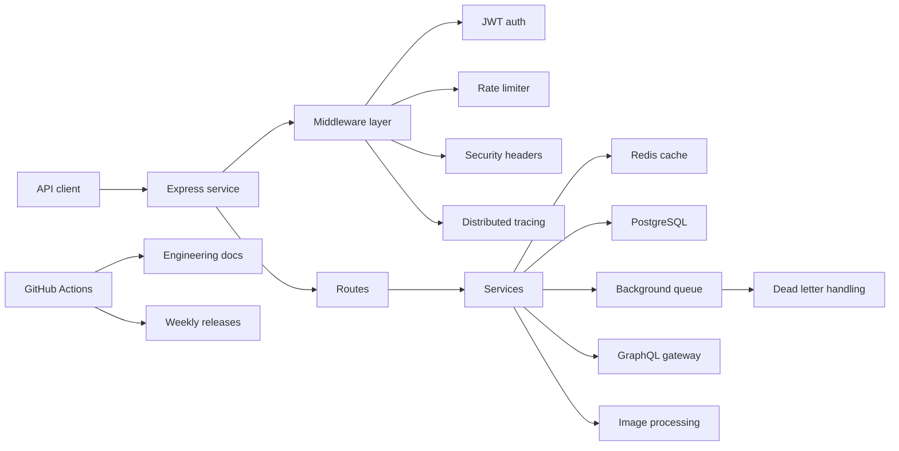

# Daily Activity

[](https://github.com/P-r-e-m-i-u-m/daily-activity/actions/workflows/daily-commit.yml)
[](https://github.com/P-r-e-m-i-u-m/daily-activity/actions/workflows/engineering-docs.yml)
[](https://github.com/P-r-e-m-i-u-m/daily-activity/actions/workflows/release.yml)
[](LICENSE)

Production-style Node.js service and automation lab for showing consistent engineering practice: API hardening, Redis-backed reliability patterns, scheduled maintenance, engineering docs, release hygiene, and operational records.

This repository is intentionally more than a basic API demo. It keeps a visible trail of system changes, incident notes, RFCs, ADRs, dependency maps, and scheduled workflow maintenance.

## What This Repo Shows

| Area | Evidence |
| --- | --- |
| API reliability | Health checks, retry helpers, connection management, queue processing |
| Security posture | JWT validation, CORS controls, rate limiting, security headers, audit notes |
| Performance work | Cursor pagination, composite indexes, query analysis, cache patterns |
| Operations discipline | Incident reports, architecture docs, release notes, scheduled automation |
| GitHub automation | Daily updates, docs generation, issue lifecycle, release workflow, wiki updates |

## System Snapshot



## Tech Stack

| Layer | Technology |
| --- | --- |
| Runtime | Node.js 18+ |
| API | Express |
| Auth | JWT |
| Cache | Redis |
| Database | PostgreSQL |
| Testing | Jest, Supertest |
| Automation | GitHub Actions |
| Documentation | ADRs, RFCs, incidents, architecture notes |

## Repository Map

```text
.
|-- .github/workflows/     # Scheduled automation and maintenance workflows
|-- docs/                  # ADRs, RFCs, incidents, security audits, architecture notes
|-- src/                   # API, middleware, services, queue, utils, migrations
|-- CHANGELOG.md           # Release history
|-- Dockerfile             # Container runtime
`-- package.json           # Scripts and dependencies
```

## Quick Start

```bash
git clone https://github.com/P-r-e-m-i-u-m/daily-activity.git
cd daily-activity
cp .env.example .env
npm install
npm run dev
```

## Useful Commands

```bash
npm start
npm run dev
npm test
npm run lint
npm audit
```

## Documentation

- [Documentation hub](docs/README.md)
- [Architecture overview](docs/ARCHITECTURE_OVERVIEW.md)
- [Operations runbook](docs/OPERATIONS_RUNBOOK.md)
- [Maintenance scorecard](docs/MAINTENANCE_SCORECARD.md)
- [Changelog](CHANGELOG.md)

## Automation

The repo uses scheduled GitHub Actions for daily activity, issue maintenance, engineering docs, releases, wiki updates, and recurring review workflows. Existing workflows are kept deliberately visible so reviewers can inspect the system history and operational rhythm.

## Engineering Principles

- Prefer small, reviewable changes.
- Keep production risks documented.
- Treat incidents as learning records, not hidden mistakes.
- Back automation with docs and release notes.
- Keep scheduled work observable through GitHub Actions.

## License

MIT
